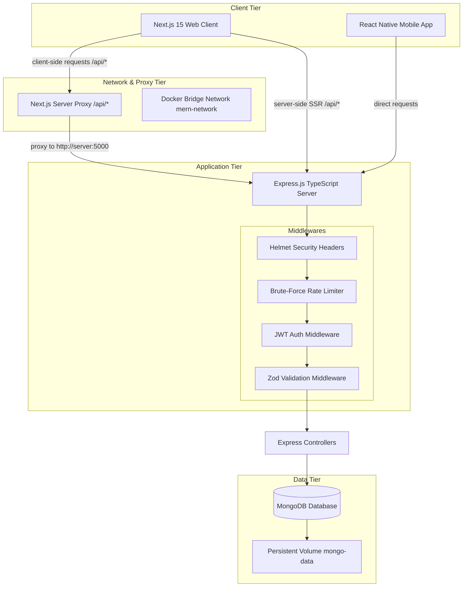

# Premium MERN Stack E-Commerce Web & Mobile Application

A production-grade, full-stack e-commerce ecosystem consisting of a Next.js 15 web client, an Express.js TypeScript server, and a React Native mobile application, all styled with a unified, premium Midnight Dark and Indigo design system.

---

## 🚀 Tech Stack

### 💻 Web Client (`client`)
* **Framework:** Next.js 15.5 (App Router) & React 19
* **State Management:** Redux Toolkit (Slices for Auth, Cart, and Orders)
* **Styling:** TailwindCSS v4 with `@theme` configurations mapping premium dark design tokens
* **Visual Highlights:** Glassmorphic card overlays, backdrop blurs, responsive grids, hover transitions, and dark UI inputs
* **SEO & Semantics:** HTML5 semantic tags, structured layout metadata, single-h1 hierarchy, and unique elements test IDs

### ⚙️ Backend Server (`server`)
* **Environment:** Node.js, Express.js (TypeScript)
* **Database:** MongoDB & Mongoose ORM
* **Authentication:** JWT (JSON Web Tokens) with custom authentication middleware
* **Security & Hardening:**
  * **Helmet:** Protection against cross-site scripting (XSS), clickjacking, and header vulnerabilities
  * **Rate Limiting:** Brute-force protection on authentication routes (100 requests per 15 mins)
  * **Zod Schemas:** Typesafe request validation middleware checking body inputs at the route level
* **Seeding:** High-performance seeder script utilizing Faker to generate up to 1,000,000 realistic products with custom ratings and reviews

### 📱 Mobile App (`EcommerceApp`)
* **Framework:** React Native (TypeScript)
* **Navigation:** React Navigation (AppNavigator, MainTabNavigator tab navigation)
* **Theme:** Customized premium dark theme configuration matched with the web interface
* **State Management:** Redux & React Redux

---

## 🏗️ System Design & Architecture

The application is structured as a multi-tier decoupled system designed for scalability, security, and low-latency client rendering.



### 1. Dual-Path Network Routing
To ensure robust connectivity across different runtime environments:
* **Browser-side Traffic:** The browser calls relative `/api` paths (e.g. `/api/products`). The Next.js server proxies this traffic to `http://server:5000` via its built-in rewrite configuration. This prevents browser **CORS (Cross-Origin Resource Sharing)** issues.
* **Server-side Rendering (SSR):** When Next.js renders pages on the server (e.g. initial load or static generation), requests run inside the `client` container. Axios detects the server context and makes direct calls to the internal container URL `http://server:5000/api` over the internal Docker network, bypassing the loopback wrapper.

### 2. Request Security Pipeline
Every incoming API request to the backend server must pass through a strict security checklist:
1. **Helmet Filters:** Protects headers from script injection and frame hijacking.
2. **Rate Limiting:** Authentication endpoints restrict requests to 100 requests per 15 minutes to block brute-force attempts.
3. **JWT Authentication:** Extracts and validates the token from the HTTP `Authorization` header.
4. **Zod Validation:** Sanitizes and checks request bodies against strict schemas before DB querying (returning a structured `400 Bad Request` if parameters are invalid).

### 3. Database Performance
To handle massive datasets (the project seeds **1,000,000+ realistic products** for benchmarking):
* Database queries use optimized Mongoose indexes on fields like `email`, `isAdmin`, `favorites.product`, and `createdAt` to ensure sub-millisecond lookup speeds.
* Cart aggregation and item calculations are precomputed inside document hooks before persistence.

---

## 📁 Repository Structure

```
├── client/          # Next.js 15 web application
├── server/          # Express.js backend server (TypeScript)
├── EcommerceApp/    # React Native mobile application
├── docker-compose.yml # Orchestrates MongoDB, Node Server, and Next Client
└── README.md        # Main repository documentation
```

---

## ⚡ Getting Started

### 1. Docker Compose (Recommended)
To spin up the entire ecosystem (database, backend server, and web client) automatically with a single command:

```bash
docker compose up -d --build
```

This will deploy:
* **MongoDB:** `localhost:27017`
* **Express Server:** `localhost:5000` (API endpoint)
* **Next.js Client:** `localhost:3000`

### 2. Manual Local Development

#### **Run the Backend Server:**
1. Navigate to `/server`:
   ```bash
   cd server
   ```
2. Install dependencies:
   ```bash
   npm install
   ```
3. Run in development mode:
   ```bash
   npm run dev
   ```

#### **Run the Web Client:**
1. Navigate to `/client`:
   ```bash
   cd client
   ```
2. Install dependencies:
   ```bash
   npm install
   ```
3. Run in development mode:
   ```bash
   npm run dev
   ```
   *(If port 3000 is occupied, it will automatically run on port 3001).*

#### **Run the Mobile App (`EcommerceApp`):**
1. Navigate to `/EcommerceApp`:
   ```bash
   cd EcommerceApp
   ```
2. Install dependencies:
   ```bash
   npm install
   ```
3. Start the Metro bundler:
   ```bash
   npm start
   ```
4. Run on Android:
   ```bash
   npm run android
   ```

---

## 🔒 Security & Validation Details

The API utilizes a strict route-level middleware to sanitize inputs before database queries run. When validation fails, a structured JSON response is returned:

```json
{
  "message": "Validation failed",
  "errors": [
    { "field": "email", "message": "Invalid email address" },
    { "field": "password", "message": "Password is required" }
  ]
}
```
All API traffic is protected by `helmet` security configurations, and authentication routes are throttled to 100 requests per 15 minutes.
